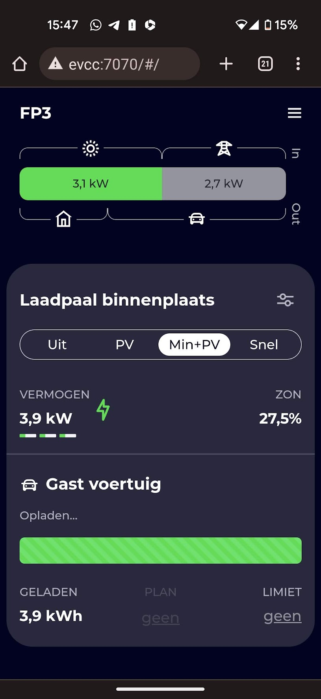

# EVCC configuratiestappen voor een Nederlandse slimme meter.
EVCC is een open source project waarmee je je laadpaal kan aansturen om zoveel mogelijk op zonnestroom te laden. Dit project is een voorbeelduitwerking van de hiervoor benodigde (minimale) configuratie.

# Disclaimer
*Ik ben geen electricien en ik ben ook niet opgeleid om elektrische installaties te installeren of te ontwerpen. Ben jij zelf niet deskundig? Gebruik dit artikel dan om samen met je installateur te kunnen bespreken hoe je EVCC op een veilige manier kan toepassen in jouw specifieke situatie*

# Welke integraties heeft EVCC minimaal nodig?
In EVCC kan je allerlei apparaten koppelen, zoals thuisbatterijen en PV-installaties. Wat je *minimaal* nodig hebt om je auto op zonne-energie te laden, is een koppeling van EVCC met je laadpaal en met de slimme meter. 

De slimme meter wordt uitgelezen om te bepalen wat je huishouden op ieder moment teruglevert aan het net. EVCC kan dan bepalen of er een overschot is waarmee de auto geladen mag worden. EVCC moet vervolgens met je laadpaal kunnen communiceren om aan te sturen of er danwel (1) *niet* geladen mag worden, (2) op de *minimale stroomsterkte* benodigd voor de auto geladen mag worden, of dat (3) er op *vol vermogen* geladen mag worden.

De tweede optie is bedoeld voor situaties waarin er minder PV-vermogen beschikbaar is dan het minimale vermogen om je EV mee te kunnen laden. Door te limiteren op het minimum laadvermogen, laad je effectief zoveel mogelijk uit de opbrengst van je panelen. 

# Werkt mijn OCPP backoffice (zoals E-Flux of LMS) dan nog om laadkosten door te kunnen belasten?
Ja, bij mij wel in ieder geval. Mijn Alfen laadpaal is met E-Flux verbonden en dat werkt prima. E-flux bepaalt of de laadsessie mag starten en trackt de sessies voor kostenbeheer. EVCC beheert vervolgens op hoeveel vermogen die sessies mogen laden. In principe is EVCC een alternatief load balancing systeem. In plaats van de P1 poort, stel je de laadpaal in om obv input van EVCC het laadvermogen te beheren.

# Maar werkt loadbalancing met de P1 poort dan nog?
Volgens mij niet. De laadpaal wordt geconfigureerd om EVCC, in plaats van de P1 poort, als databron voor het toelaatbare laadvermogen te gebruiken. EVCC zou dan de load balancing moeten doen, en ik ben nog geen instelling tegengekomen om dynamisch het max laadvermogen te beheren rekening houdende met andere grootverbruikers in je huis. 

Wel kan je een statische max current instellen (bij mij ingesteld op 16A). 
# Het stappenplan voor de minimale configuratie
## Configuratie van de Alfen laadpaal
### Benodigde licentie
Je laadpaal heeft een geactiveerde licentie voor de "Active Load Balancing" nodig.
### Configuratie laadpaal voor EVCC
De onderstaande instellingen heeft de installateur voor mij bij oplevering heeft ingesteld. De installateur doet dat met de ACE tool van Alfen. Zelf kan je ook de ACE tool bij Alfen downloaden en gebruiken. Wel moet je dan het wachtwoord van je laadpaal weten.

Overige instellingen voor mijn installatie (3x25A netaansluiting):
- Station max current: 20a
- Connector 1 max current: 20a 
- Backoffice preset: E-flux-platform
- Protocol - OCPP 1.6

Verder is de laadpaal ingesteld om via **DHCP automatisch** een IP adres te krijgen. Volgens mij is dit de standaard instelling. In de handleiding staat ergens dat het standaard IP adres van de laadpaal 169.254.1.10 is, maar let op, dat is geen normaal statisch IP adres, maar een fallback IP adres voor als er geen DHCP server op het netwerk actief is. De 169.254.0.0/16 range is een APIPA range (Automatic Private IP Addressing)

### Bekabeling
Je hebt een UTP kabel nodig van je router of switch naar de Ethernet poort op je Alfen laadpaal. **Vraag dit specifiek aan je installateur om op te leveren.** In de meeste standaard installaties wordt er alleen een UTP kabel op de P1 poort naar de P1 poort in je meterkast gelegd.

Liggen alle kabels al in de grond? Dan is er een workaround. De P1 poort heeft namelijk maar 2 aders van de UTP kabel nodig. En 10Base-T (100mbit) heeft slechts vier aders nodig. Een UTP kabel heeft 8 aders. Je kan dus aan ieder uiteinde van de UTP kabel zowel een P1 als RJ45 connector bevestigen. Ik heb dit zelf echter niet getest en zou indien mogelijk de aanleg van 2 UTP kabels aanbevelen. 

### Static DHCP mapping voor laadpaal in je router
EVCC zal via je TCP/IP netwerk contact zoeken met je laadpaal. EVCC moet dus het IP adres van je laadpaal weten, dus die mag niet telkens veranderen.

In mijn geval heb ik mijn DHCP server op mijn router ingesteld om altijd hetzelfde IP-adres te vergeven aan het MAC adres van de Alfen laadpaal.
Dit is hoe ik dat heb gedaan:
1. Verbind de Alfen ethernetpoort met je switch of router en kijk of de lampjes branden op je switch/router die aangeven dat de link actief is
2. Schakel de laadpaal met de aardlekautomaat uit en weer in, dit zodat de laadpaal via DHCP een IP adres probeert te verkrijgen
3. Kijk op je router bij DHCP leases welk adres er aan je laadpaal vergeven is en noteer het MAC hardware adres
4. Configureer je DHCP server om met een 'static mapping', 'static lease' of ook soms 'reservering' genoemd, altijd hetzelfde IP adres aan de laadpaal te vergeven
5. (In mijn geval heb ik een IP adres buiten de DHCP ip pool ingesteld)
6. Schakel de aardlekautomaat van de laadpaal opnieuw uit en in, zodat de laadpaal bij opstarten het gereserveerde IP adres van de DHCP server verkrijgt.
7. Probeer het IP te pingen om te kijken of alles werkt.

Beschikt je DHCP server niet over de mogelijkheid om een vast IP adres te koppelen aan een MAC adres? Configureer de laadpaal dan om zelf een statisch ip aan te nemen.

# Configuratie van de software
Nu de laadpaal verbonden is met het netwerk en geconfigureerd is, kunnen we de software gaan installeren.
## EVCC Sponsortoken
Om de Alfen EVCC integratie te kunnen gebruiken moet je op de website van EVCC een sponsortoken ophalen. Dat kost je 2 USD per maand. Dit is hoe het werkt: Als je de github repo van EVCC met 2 USD/mnd sponsort, dan kan je op de website van EVCC een token ophalen. Zie deze link voor meer info: https://sponsor.evcc.io/
## Pas .env configuratiebestand aan
Open het `.env bestand in de root van de git repository en configureer de variabelen met de juiste instellingen.
## Start de containers
Download de source van deze git repository, navigeer in bash shell naar het pad waar docker-compose.yml is opgeslagen en voer uit `docker-compose up -d`

## DSMR-Reader API actieveren voor EVCC
We gaan gebruik maken van een open source project dsmr-reader om de P1 poort uit te lezen. Met mijn Landis Gyr E350 slimme meter werkte alles out of the box. Er zijn twee manieren om EVCC de data uit DSMR-Reader te laten ophalen, via de WebAPI of via MQTT. Ik kies voor de WebAPI omdat ik dan niet de extra schakel van de MQTT server nodig heb.

Start de DSMR docker container en navigeer naar http://JOUW_DOCKER_HOST:7777/admin/

Klik vervolgens op API configuratie om een API key te genereren, noteer deze key

Het leuke van DSMR-Reader is dat je ook een energiedashboard van je huis, als de docker draait hier te vinden: http://JOUW_DOCKER_HOST:7777/
## Wijzig  evcc.yaml configuratiebestand
Open `./data/evcc/evcc.yaml`
1. Vul je sponsor token in bij `PUT_YOUR_EVCC_SPONSOR_TOKEN_HERE`
2. Vervang `PUT_YOUR_DSMR_API_KEY_HERE` (let op, 7x, evcc.yaml ondersteund helaas geen environment vars of secrets.yaml)
3. Vervang `PUT_THE_IP_OF_YOUR_ALFEN_CHARGER_HERE` door het IP adres van je laadpaal zoals in de statische DHCP mapping geconfigureerd
4. Nu EVCC herstarten: `$ docker restart evcc` en check de logs op evt fouten: `$ docker logs -f evcc`
5. Benader EVCC op http://DOCKER_HOST_IP:7070 en kijk of het werkt!

## Testen maar!
1. Hang je EV aan de lader en gebruik evt. je laadpas om de laadsessie te starten.
2. Wijzig tijdens de laadsessie de instelling "uit" "pv" "pv+min" en "snel" en kijk of het laadvermogen zoals verwacht reageert (duurt telkens even)
3. Beeindig de laadsessie en controleer evt. in de E-flux/LMS backoffice of de laadsessie daar ook geregistreerd is en of de kostenregistratie op de juiste manier verloopt.
